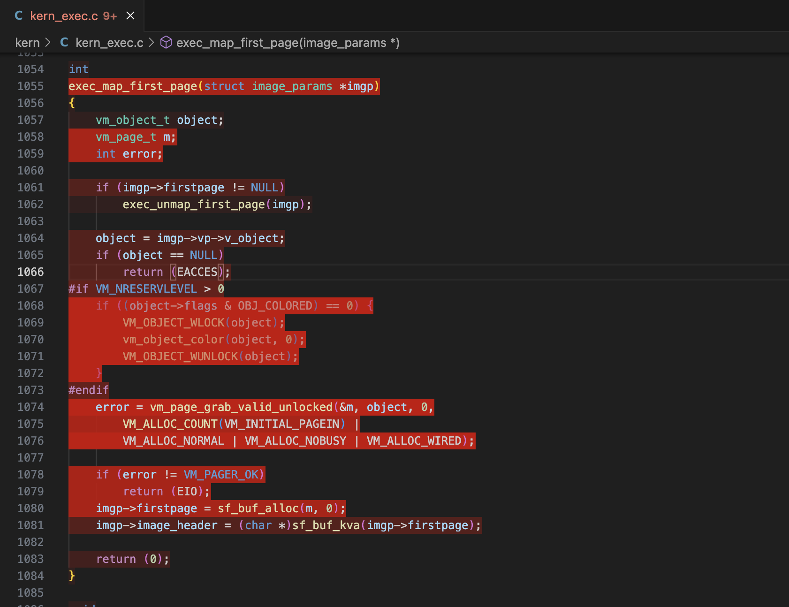

# Heatmap for VS Code

Heatmap lets you visualise the relative age of lines in source under Git version
control.  By toggling the heatmap on, the background colour of every line in the
file is altered to reflect the relative age; the brightest lines are the most
recent.

Requires `git` in your `$PATH`.

Originally created to help understand how code has changed over time while
auditing for security issues.

## Installation

Install through the Visual Studio Code Marketplace:
https://marketplace.visualstudio.com/items?itemName=chrisjdavies.heatmap

## Example

Here's a screenshot showing the relative age of some lines in the FreeBSD kernel
source:

## Commands

Heatmap adds the following commands to the command palette:

- Heatmap: On
- Heatmap: Off

## Configuration

|Property|Description|Type|Default value|
|---|---|---|---|
|`heatmap.heatLevels`|The number of different heat levels to visualise.|Integer|10|
|`heatmap.heatColour`|The colour of the "hottest" heat level (most recent changes), as a list of numbers R, G, B, or a hex colour code.|String|`200,0,0` or `#C80000`|
|`heatmap.coolColour`|The colour of the "coolest" heat level (oldest changes), as a list of numbers R, G, B, or a hex colour code.|String|Same as heatColour, but with 100% alpha|
|`heatmap.showInRuler`|Whether to show the heatmap in the overview ruler.|Boolean|true|

## Thanks

- Thanks to DALL-E 3 for generating the icon/logo.
- Thanks to @nhale25 (Nick) for contributions and improvements.
